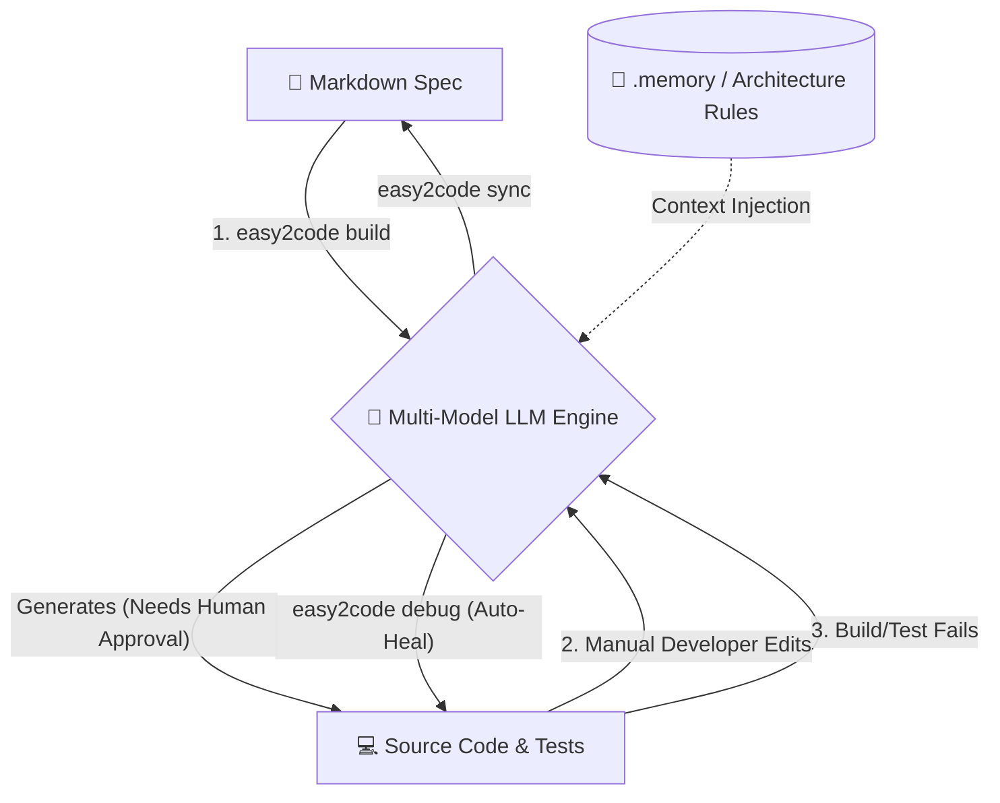

# easy2code: Spec-Driven Development Command Line Interface

The `easy2code` application is an artificial intelligence-driven, language-agnostic Command Line Interface (CLI) designed to bridge the operational gap between pre-existing architectural paradigms (brownfield development) and contemporary AI-assisted code generation. The system is engineered entirely upon the principles of **Spec-Driven Development (SDD)**.

In contrast to standard AI coding assistants that frequently generate isolated, context-deficient code segments, `easy2code` functions as an autonomous engineering utility that strictly adheres to a project's established architectural rules and formatting conventions.

### Core Innovation: The Closed-Loop Synchronization System

The primary differentiator of the `easy2code` architecture is its bidirectional synchronization engine. The utility does not merely generate components from a static specification; rather, if a developer applies manual modifications to the generated source code, the system is capable of reverse-engineering those alterations to autonomously update the originating Markdown specifications. Furthermore, in the event of a compilation or testing failure, the integrated AI debugging module autonomously identifies the erroneous file, formulates a programmatic remediation, and presents it for human review and approval.

---

## 📖 Methodology: Spec-Driven Development (SDD)

Spec-Driven Development (SDD) is a software engineering methodology wherein human-readable specifications (typically formatted in Markdown) function as the definitive source of truth. Under this paradigm, specifications are formalized prior to implementation, and the artificial intelligence engine is tasked with generating the corresponding source code to fulfill the established contractual requirements.

### Limitations of Conventional AI Integration

Standard AI generation relies heavily on unstructured prompting. Requesting an AI to generate a component often yields code that functions in isolation but violates enterprise architecture guidelines. For example, it may introduce unauthorized HTTP clients or alter established state management protocols.

### The SDD Advantage

1. **Elimination of Architectural Drift:** Formal specifications explicitly define project constraints, ensuring strict architectural compliance.
2. **Standardization of Inputs:** The necessity for complex "prompt engineering" is removed; engineers draft standard technical specifications, and the AI translates these requirements based on the project's historical data.
3. **Living Documentation:** The bidirectional synchronization ensures that official documentation and the deployed source code remain in absolute parity.

---

## ⚙️ Operational Architecture (Under the Hood)

The `easy2code` utility operates through four distinct, systematic phases:

1. **Context Initialization (`--scan`):** The CLI analyzes the existing repository, identifying file extensions, package management systems, and prevalent code patterns to generate `.memory` files. This constitutes the project's architectural baseline.
2. **Agentic Generation (`build`):** Upon receiving a Markdown specification, the system synthesizes the requirements with the `.memory` rules. It then routes the prompt to a designated Large Language Model (e.g., Claude, Gemini, or Ollama) to generate highly specific components and corresponding test files.
3. **Bidirectional Synchronization (`sync`):** The system monitors file integrity via cryptographic hashing. Should a developer manually modify a generated file within an Integrated Development Environment (IDE), the CLI detects the differential and utilizes AI to recursively update the Markdown specification.
4. **Autonomous Remediation (`debug`):** If an automated build or testing sequence registers a failure, the utility intercepts the resulting stack trace, isolates the compromised file, formulates a localized patch, and automatically re-executes the build sequence.

### Process Flowchart



---

## 💻 Installation and Deployment Procedures

The `easy2code` package is distributed via the Node Package Manager (NPM) registry and requires a Node.js runtime environment (version 18.0.0 or higher).

```bash
# 1. Execute global installation via NPM
npm install -g easy2code

# 2. Configure environmental variables for preferred AI Provider API Keys
# (Note: This step is omitted if utilizing localized Ollama execution)
export ANTHROPIC_API_KEY="sk-ant-..."
export GEMINI_API_KEY="AIza..."

# 3. Navigate to the target repository and initialize context extraction
cd project-directory
easy2code init --scan --claude

# 4. Process a standardized specification document to generate source code
easy2code build feature_specification.md --gemini

```

---

## 🧰 Command Line Interface Reference

The following table delineates the primary commands supported by the `easy2code` CLI:

| Command | Operational Description | Supported Provider Flags |
| --- | --- | --- |
| `init --scan` | Analyzes the current repository to reverse-engineer architectural parameters into the `.memory` directory. | `--claude`, `--gemini`, `--ollama` |
| `build <spec>` | Processes a designated Markdown specification to generate corresponding source code and testing suites. | `--claude`, `--gemini`, `--ollama` |
| `sync` | Identifies manual source code modifications and recursively updates the associated Markdown specifications. | `--claude`, `--gemini`, `--ollama` |
| `debug` | Autonomously detects build parameters, intercepts execution errors, and initiates the automated remediation loop. | `--claude`, `--gemini`, `--ollama` |
| `clean` | Purges the internal `.easy2code` tracking metadata to reset the project environment. | N/A |

---

## 📊 Comparative Industry Analysis

While various proprietary tools exist within the AI development sector, `easy2code` is engineered specifically to address the complexities of legacy (brownfield) applications and to enforce strict architectural adherence.

| Feature Classification | `easy2code` (This Utility) | GitHub Copilot | AWS Kiro | Google Gemini (IDE Integration) |
| --- | --- | --- | --- | --- |
| **Primary Methodology** | **Spec-Driven Inheritance.** Extracts and adheres to existing repository DNA. | **Inline Assistant.** Contextual autocomplete and chat for the active document. | **Architect-First.** Optimized for AWS-native project scaffolding. | **Chat-First.** Conceptual exploration and isolated snippet generation. |
| **Legacy/Brownfield Support** | **Extremely High.** Comprehensive scanning of existing repositories to generate baseline rules. | Medium. Context is generally limited to the active file within the IDE. | Medium. Primarily designed for the instantiation of new cloud services. | Medium. Requires manual curation of the contextual window. |
| **Documentation Synchronization** | **Bidirectional.** Code modifications systematically update the originating Markdown specification. | None. Documentation maintenance remains a manual developer requirement. | Unidirectional. Specifications generate code, but not vice versa. | None. |
| **Autonomous Remediation** | **Closed-Loop Automation.** Intercepts stack traces, isolates faults, and applies programmatic fixes. | Manual. Requires the developer to manually submit errors to the chat interface. | Automated agentic loops; however, heavily reliant on cloud infrastructure. | Manual. Requires the developer to manually submit errors. |
| **Execution Privacy** | **100% Localized Capability.** Complete support for local `Ollama` models. | Cloud-dependent. Telemetry and data are transmitted to external servers. | Cloud-dependent. Data is processed via AWS Bedrock. | Cloud-dependent. Data is processed via external servers. |
| **Model Agnosticism** | **Provider Independent.** Seamless transition between Claude, Gemini, and local Llama frameworks. | Locked to OpenAI models. | Locked to AWS Bedrock models. | Locked to Gemini models. |

---

## 🔒 Security and Confidentiality Framework

The architecture of `easy2code` is constructed with the rigorous security requirements of enterprise environments as a foundational priority:

* **Contextual Data Isolation:** The application does not upload or transmit the entire repository. External API transmissions are strictly limited to the specific `.memory` rules and the immediate files undergoing modification.
* **Air-Gapped Execution Readiness:** By invoking the `--ollama` operational flag, 100% of the cognitive reasoning and code generation processes occur locally on the host machine's hardware. Under this configuration, proprietary source code never traverses external network perimeters.

---

## 🤝 Contribution Guidelines

Professional contributions to the project infrastructure are highly encouraged. Prospective contributors are advised to review the official `CONTRIBUTING.md` document for detailed information regarding the established code of conduct, development standards, and the formal process for submitting pull requests.
